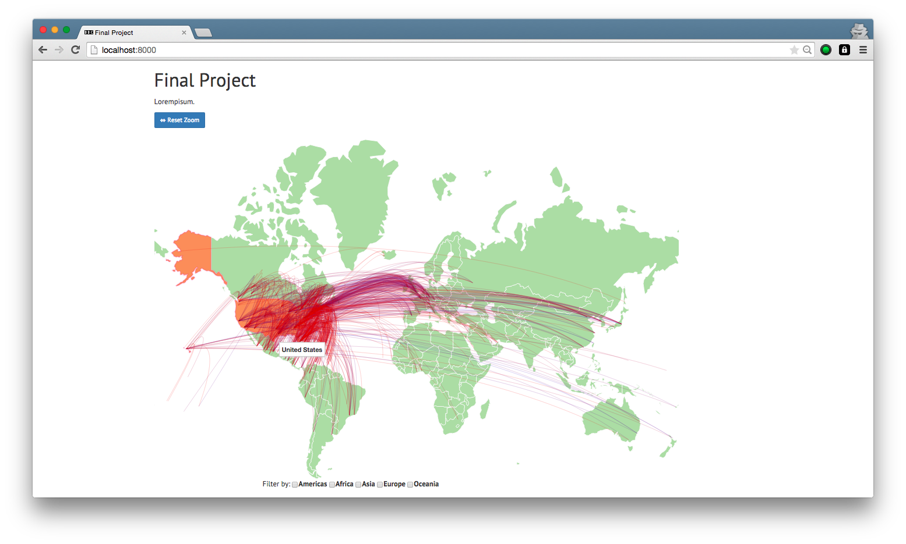

## Flight Visualization

*by Zeno Ziemke (ziemke@college.harvard.edu), Masahiro Kusunoki (mkusunoki@college.harvard.edu), Nhu Nguyen (nhunguyen@college.harvard.edu)*

	

Process Book can be found [here](http://maza5296.github.io/cs171-project/).

Design Studio feedback can be found [here](https://www.youtube.com/watch?v=ajYWUTMBjZY&feature=youtu.be).

#Folder structure
/data/ contains the raw data sources as well as reformatted versions of the data that we created on our own.
We have to thank our TF Andrew for converting the UNData set from csv to json, since this dataset was in a complex format.

/css/ contains stylesheets
we used the bootstrap css framework 

/documentation/ contains the proposal and process book

/img/ contains images for the process book and the visualization, which we got from various sources

flight.html contains the main code of the visualization

index.html contains the landing page

/js/ contains the code for individual visualizations (line charts, barcharts etc.)

/libs/ contains the external libraries that  we used: d3, bootstrap (for the airline table sorting/pagination functionality), jquery, datamaps.io.
The datamaps library was extensively extended by us (support for multiple maps, support for custom maps, option to zoom to continents, option to zoom into specific countries, custom transitions, etc.)

Templates or guides that were used for parts of the code are indicated in the processbook.

#Non obvious features
Clicking on an airline in the airlines table will visualize the flight network of the airline on the map.
All data shown is from 2012, if not indicated otherwise